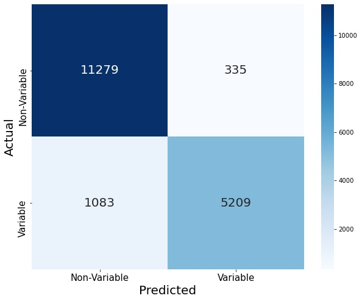

# StarVariabilityML
## Index
- [Overview](#Overview)
- [Buisness Problem](#buisness-problem)
- [Data Understanding](#data-understanding)
- [Methods](#methods)
- [Results](#methods)
- [Conclusion](#conclusion)
- [For More Information](#for-more-information)
- [Repository Structure](#repository-structure)

## Overview
We looked at data that the ESA's Hipparcos satellite gathered between 1989 and 1993 and made a machine learning model to predict whether a star is variable or not. The data we used can be found [here.](https://www.kaggle.com/datasets/konivat/hipparcos-star-catalog)


## Buisness Problem
Nasa is planning to observe the stars that the European Space Agency's astrometric satellite, Hipparcos, observered from August 1989 to August 1993. Specificaly they want to observe variable stars. We are tasked with coming up with a list of stars that are likely to be variable so that Nasa does not waste time and money on observing stars that are not variable. However Nasa would rather observe a few non-variable stars than miss a variable star. So, we will focus on minimizing false negatives.


## Data Understanding
For this project, we used data collect from The European Space Agency's astrometric satellite, Hipparcos. The data contained two portions; one were the target(Variablity) is null and another were the target is not null. These two portions were sepperated into two sets of data: UntestableData.csv and UsableData.csv. The UsableData.csv was used to train and test all of our models. The our final model was used on the UntestableData.csv to given nasa a list of stars that are likely variable.

## Methods

### Data Cleaning
This data had a lot of features, and a lot of null values. The first thing we did with the data was separate it into two datasets; one where the target is null and one where it is not. We needed to look at our target and understand what we should put as 0 and what should be 1. Through analysis of data, we determined everything except 'C' indicated the star was variable, so we separated it into 'C' as 0, and any other value as 1.

Data exploration showed that there were some columns that would not be useful or usable for predicting variability. These columns include unique identifiers like HIP, HD and CoD, but it also included features that are always null when the star is unclassified like Period and VarFlag. So, we drop those columns before doing anything else.

Looking at our target value, we do see a class imbalance of 65% non-variable to 35% variable. This is a small enough imbalance that we won't worry about over or undersampling to deal with it, but still needs to be accounted for when we look at our metrics.

### Modeling
For our models we treated the star having variance as a positive and no variance as a negative. Do to Nasa want to miss as few stars as possible we shall be optimizing on recall.

### Initial Model
Our initial model was a [LogisticRegression model](https://scikit-learn.org/stable/modules/generated/sklearn.linear_model.LogisticRegression.html). We used this model on every single column in our data set. This model was fairly accurate, and had a test recall of 82%.


### Intermediate Models
Although the logistic regression performed quite well, we tried different model types; we did [Naive Bayes](https://scikit-learn.org/stable/modules/naive_bayes.html) and [Decision Tree](https://scikit-learn.org/stable/modules/tree.html) models.

The naive bayes model didn't perform well, so we didn't explore it further. It makes sense that the naive bayes model didn't perform well because the nb model operates under the assumption that all features are independent from each other, which is not true in this case, many of our variables are related to each other.

Since the naive bayes model didn't look promising, we moved on to a decision tree to see if that would perform better than our logistic regression using the same method of throwing all of the data into the tree. We started with an untuned tree, which was very overfit, but after some initial tuning we got a more useful model.


This slightly tuned tree was performing better than our logistic regression, so we decided to continue exploring tree models.

### Final Model
After those initial models, we experimented with our decision tree. Our explorations showed that the object columns were not helping our model, so we moved on to only using our numeric values.

We further refined it by trying different numeric columns to see what was useful, and ended up with a final model that produced fewer false negatives.


## Results
With our final model made, we used it to predict on the unclassified data and we have our list of predicted variable stars at the bottom of FinalNotebook.ipynb

## Conclusion
So now we have a list of stars predicted to be variable for NASA to observe. If given more time, we could further refine our model with a bit more feature engineering and model tuning to produce more accurate predictions.

## For More Information
[Data set location](https://www.kaggle.com/datasets/konivat/hipparcos-star-catalog)

[LogisticRegression model](https://scikit-learn.org/stable/modules/generated/sklearn.linear_model.LogisticRegression.html)

[Naive Bayes](https://scikit-learn.org/stable/modules/naive_bayes.html)

[Decision Tree](https://scikit-learn.org/stable/modules/tree.html)

[FinalNotebook](https://github.com/pjlannoo/StarVariabilityML/blob/main/FinalNotebook.ipynb)

[Presentation](https://github.com/pjlannoo/StarVariabilityML/blob/main/Variable%20Star%20Classification.pdf)
## Repository Structure

```
├── Images                                                  <- Images
├── Notebooks                                               <- Rough Working Directory
|   ├── ConnorWorkSpace
|   |   ├── Cleaning.ipynb                                  <- Rough Jupyter Notebook: Cleaning
|   |   ├── Models.ipynb                                    <- Rough Jupyter Notebook: Models
|   |   └── More Models.ipynb                               <- Rough Jupyter Notebook: Indepth look through of columns
|   ├── PhilWorkspace
|   |   ├── ModelingNB.ipynb                                <- Rough Jupyter Notebook: Modeling
|   |   ├── ObjColExploration.ipynb                         <- Rough Jupyter Notebook: Obj Exploration
|   |   └── WorkNotebook.ipynb                              <- Rough Jupyter Notebook
|   ├── ColumnDescriptions.ipynb                            <- Brief Description of all Columns
|   └── DataSeparation.ipynb                                <- Seperating out the Data: Train and Test
├── data                                                    <- Rough Working Directory
|   ├── UntestableData.csv                                  <- Nulls in the Target
|   ├── UsableData.csv                                      <- Non-Nulls in the Target
|   └── hipparcos-voidmain.csv                              <- Unsplit Data
├── .gitignore                                              <- Standard python gitignore file
├── Final NoteBook.ipynb                                    <- Final Jupyter Notebook
├── README.md                                               <- You Are Here   X 
└── Variable Star Classification.pdf                        <- Final Slides Presentation
```